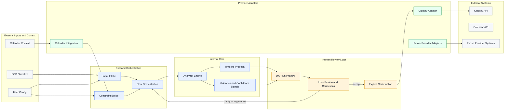

# AI-Assisted Timesheet Reconstruction Docs

This folder captures the architectural decisions for the Clockify-oriented timesheet reconstruction system discussed in the shared conversation:

- semantic narrative in,
- plausible timeline proposal out,
- explicit human review before submission.

## What matters most

- The system optimizes for plausibility, not factual reconstruction.
- The user is always the final authority.
- The internal domain must stay independent from any single provider.
- Clockify is an adapter target, not the core model.
- Calendar context is advisory and constraint-building input, not truth.

## High-Level Architecture

This diagram is intentionally interaction-focused. It shows how information moves through the system without re-explaining every domain concept visually.

## Start Here

- [Architectural Principles](./blueprint/architectural-principles.md)
- [Architecture Decisions](./decisions/README.md)
- [Domain Overview](./domain/domain-overview.md)
- [Analyzer Overview](./analyzer/analyzer-overview.md)
- [System Vision](./blueprint/system-vision.md)
- [High-Level Architecture](./blueprint/high-level-architecture.md)
- [Operational Pipeline](./blueprint/operational-pipeline.md)
- [Glossary](./blueprint/glossary.md)
- [Provider Architecture](./providers/provider-architecture.md)
- [V1 Validation Checklist](./v1-validation-checklist.md)
- [Prompt Contracts](./prompts/README.md)

## Current V1 Scope

- End-of-day narrative input
- Fixed schedule and calendar-aware constraints
- Plausible timeline reconstruction
- Clockify-compatible output
- Mandatory confirmation loop

## Explicitly Out of Scope for V1

- Autonomous timesheet submission without user approval
- Activity tracking or surveillance
- Multi-day memory continuity as a first-class requirement
- A broader cognition or memory platform
