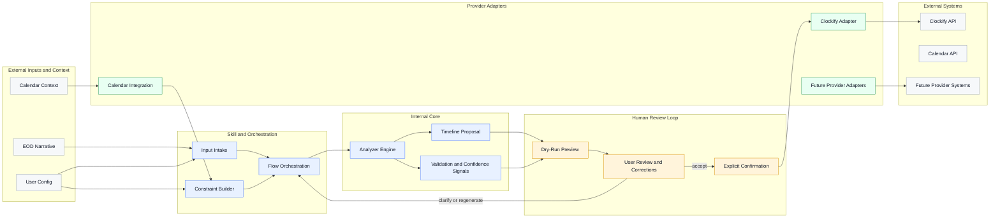

# AI-Assisted Timesheet Reconstruction Docs

This folder explains how the Clockify-oriented reconstruction system is designed, how the current V1 runtime works, and where the boundaries live between reasoning, review, and provider handoff.

## 5-Minute Mental Model

- The user provides end-of-day narrative context, not a pre-timed activity log.
- The analyzer turns that narrative into a plausible, reviewable `TimelineProposal`.
- Calendar signals and user configuration shape constraints, but they do not become the source of truth.
- The user reviews, corrects, and confirms before anything reaches a provider adapter.
- Clockify is the current delivery target, but the internal model stays provider-agnostic.

## What This System Is

- assisted timesheet reconstruction
- narrative-to-time translation
- human-in-the-loop reporting support

## What This System Is Not

- activity surveillance
- objective productivity measurement
- autonomous submission
- historical truth reconstruction

## Conceptual System Map

This diagram is intentionally conceptual. It shows the main handoffs without trying to document the current runtime wiring in detail.

## Reading Tracks

### Quick Orientation

- [System Vision](./blueprint/system-vision.md): what product this is, what it is not, and the V1 framing
- [Operational Pipeline](./blueprint/operational-pipeline.md): the end-to-end flow from narrative to provider handoff
- [Agent-Based Orchestration](./blueprint/agent-orchestration.md): how the current V1 runtime delegates that flow today

### Core Architecture

- [Architectural Principles](./blueprint/architectural-principles.md): the non-negotiable design rules
- [Architecture Decisions](./decisions/README.md): the ADR set, including active and historical decisions
- [Domain Overview](./domain/domain-overview.md): the canonical source for terminology
- [Analyzer Overview](./analyzer/analyzer-overview.md): the analyzer's job, inputs, outputs, and stage map
- [Provider Architecture](./providers/provider-architecture.md): where provider behavior starts and what it does not own
- [Glossary](./blueprint/glossary.md): a quick lookup guide when you know the question but not the page

### Current V1 Runtime

- [Agent-Based Orchestration](./blueprint/agent-orchestration.md): the executable runtime shape
- [Clockify Adapter](./providers/clockify-adapter.md): the current provider-facing handoff boundary
- [V1 Validation Checklist](./v1-validation-checklist.md): recommended implementation order and validation priorities
- [Runtime and Portability Notes](./runtime-and-portability-notes.md): runtime lessons, structural risks, and open rollout questions
- [Prompt Contracts](./prompts/README.md): prompt-stage contracts and prompt authoring order

## Current V1 Focus

- end-of-day narrative input
- hard schedule and calendar-aware constraints
- plausible timeline reconstruction
- explicit human confirmation before submission
- Clockify-compatible provider output

If you only need one canonical terminology page, start with [Domain Overview](./domain/domain-overview.md).
