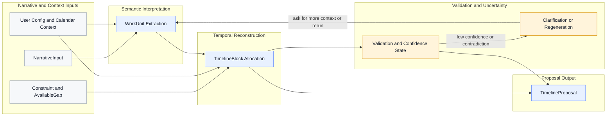

# Analyzer Overview

## Purpose

The analyzer is the core reasoning subsystem that transforms a `NarrativeInput` into a plausible, reviewable `TimelineProposal`.

Its job is to translate imperfect narrative context into a temporal proposal that:

- respects `Constraint` data,
- uses `AvailableGap` regions responsibly,
- produces coherent `TimelineBlock` allocations,
- surfaces uncertainty honestly,
- and remains easy for a human to review and correct.

It proposes plausible time. It does not observe history, invent new work, or replace the user's authority.

## Interaction Diagram

This diagram focuses on how the analyzer turns narrative and context into a reviewable proposal, and where clarification can loop the flow backward.

## Inputs

The analyzer works from a bounded set of contextual inputs:

- `NarrativeInput`: the raw end-of-day update and minimal context around it
- `Constraint`: hard temporal boundaries such as meetings, reserved time, and workday limits
- `AvailableGap`: allocatable time surfaces left after hard constraints are applied
- calendar context: advisory schedule information used during constraint-building and plausibility checks
- user configuration: workday shape, preferences, and reconstruction expectations
- operational noise assumptions: realism-preserving allowance for coordination, fragmentation, and slack

## Outputs

The analyzer produces a structured proposal, not a silent side effect:

- `TimelineProposal`: the reconstructed day
- `TimelineBlock` allocations: the proposed temporal blocks inside the proposal
- `Validation/Confidence State`: warnings, ambiguity markers, and confidence signals
- clarification requirement: whether the system should ask follow-up questions before trusting the proposal

## Analyzer Stage Map

At a high level, the analyzer operates in five stages:

1. Read and normalize the `NarrativeInput`.
2. Extract `WorkUnit` candidates from the narrative without assigning time yet.
3. Interpret the available allocation surface from `Constraint` and `AvailableGap` data.
4. Build plausible `TimelineBlock` allocations while respecting uncertainty and operational noise.
5. Emit a reviewable `TimelineProposal` plus `Validation/Confidence State`.

Canonical terminology for these pages lives in the [Domain Overview](../domain/domain-overview.md). Use that page as the source of truth for term definitions.

## Deeper Pages

- [Semantic Extraction](./semantic-extraction.md): how narrative becomes `WorkUnit` structures
- [Temporal Reconstruction](./temporal-reconstruction.md): how work becomes plausible `TimelineBlock` allocations
- [Uncertainty Model](./uncertainty-model.md): how ambiguity and confidence are represented
- [Operational Noise](./operational-noise.md): how invisible work and fragmentation are modeled
- [Clarification Loop](./clarification-loop.md): when the analyzer asks instead of guessing
- [Failure Modes](./failure-modes.md): how the analyzer fails safely
