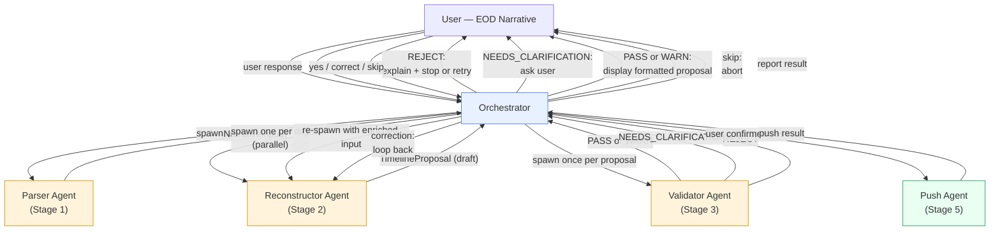

# Agent-Based Orchestration

Back to [Docs Home](../README.md), [Architectural Principles](./architectural-principles.md), and [Operational Pipeline](./operational-pipeline.md).

## Overview

This document describes the current agent-oriented pipeline used by the skill entry point. It explains how the orchestration boundary is drawn today, where Claude-side reasoning happens, and where Python execution is intentionally limited.

### Problems this architecture addresses

The technical gaps documented in [V1 Validation Checklist](../v1-validation-checklist.md) trace back to the need for an explicit stage boundary. The current architecture addresses them this way:

| Gap | How the agent model addresses it |
|---|---|
| No unified orchestration entry point | The Orchestrator agent IS the entry point. It routes between stages explicitly. |
| Context resets losing in-flight proposal state | Subagents have bounded, focused contexts and the orchestrator keeps the active proposal boundary explicit. |
| Clarification loop has no implementation path | Natural: Orchestrator collects user response, re-spawns Reconstructor Agent with enriched input. |
| Multi-day reports are sequential | Reconstructor Agents can be spawned in parallel — one per day. |
| Python boundary is ambiguous | Push Agent is the only agent that runs Python scripts. All domain reasoning stays in Claude. |

---

## Proposed Agent Breakdown

The pipeline maps to five agents plus one orchestrator. Each agent has a single responsibility, an explicit input schema, and an explicit output schema.

### Orchestrator — `clockify-timesheet` skill entry point

| Property | Value |
|---|---|
| **Pipeline stage** | All — state machine that coordinates the full flow |
| **Input** | Raw user message (EOD narrative) |
| **Output** | Confirmation of push, or abort with explanation |
| **Contract** | `skill/SKILL.md` V1 rules + ADR set |

**Responsibilities:**
- Spawn all subagents and pass structured JSON between them
- Manage pipeline state — track which stages have completed and what the current proposal is
- Handle all direct user interaction: display proposals, ask clarification questions, process corrections, wait for confirmation

**What it does NOT do:** no domain reasoning, no semantic extraction, no Python execution. The Orchestrator is a router, not a reasoner.

---

### Parser Agent

| Property | Value |
|---|---|
| **Pipeline stage** | 1 — Parse |
| **Input** | Raw narrative text + timezone from `~/.config/clockify/credentials.json` |
| **Output** | `NarrativeInput[]` — one object per reported day, JSON |
| **Contract** | Stage 1 rules from `skill/SKILL.md` |
| **Spawned** | Once per invocation. Stateless. |

**Responsibilities:**
- Identify the date(s) being reported
- Structure each day's narrative into a `NarrativeInput` without interpreting or assigning time
- Skip days with no narrative context — do not fabricate a `NarrativeInput` for missing days
- Surface ambiguity (e.g. unclear date) as a question for the Orchestrator to ask the user

**Output shape:**
```json
[
  {
    "date": "YYYY-MM-DD",
    "timezone": "America/Montevideo",
    "raw_text": "..."
  }
]
```

---

### Reconstructor Agent

| Property | Value |
|---|---|
| **Pipeline stage** | 2 — Reconstruct (Analyzer) |
| **Input** | Single `NarrativeInput` + schedule defaults/config path |
| **Output** | `TimelineProposal` (draft) — JSON |
| **Contract** | `docs/prompts/analyzer-contract.md` + Stage 2 invariants from `skill/SKILL.md` |
| **Spawned** | One per day. Multi-day reports spawn in parallel. Can be re-spawned with enriched narrative after clarification. |

**Responsibilities:**
- Semantic extraction: identify `WorkUnit` candidates from the narrative — what work happened, without time yet
- Uncertainty assessment: score narrative quality and surface ambiguity; if clarification is needed, return a `NEEDS_CLARIFICATION` signal with questions instead of a draft proposal
- Temporal reconstruction: distribute `WorkUnit` candidates into `TimelineBlock` allocations within the available gaps, using `productive_hours_per_day` as guidance rather than a mandatory fill target
- Assign optional provider-agnostic `project_key` values to non-constraint work where the narrative clearly supports one
- Assemble and return the `TimelineProposal`

**Critical invariants (from analyzer contract):**
- Allocate only within described work and available gaps
- Never reconstruct an unreported weekday
- Surface confidence and ambiguity — do not hide uncertainty
- Keep project assignment provider-agnostic
- Avoid forcing the full available surface when the narrative only supports a shorter day

This is the only agent that reasons through the semantic extraction and temporal reconstruction prompt contracts. No Python is involved — the reasoning is Claude's own.

---

### Validator Agent

| Property | Value |
|---|---|
| **Pipeline stage** | 3 — Validate |
| **Input** | `TimelineProposal` (draft) |
| **Output** | `ValidationState` — outcome + warnings + clarification questions if applicable |
| **Contract** | `docs/prompts/validation-contract.md` |
| **Spawned** | Once per proposal. Stateless — pure evaluation, no side effects. |

**Responsibilities:**
- Run the validation rules from the validation contract against the proposal
- Return one of: `PASS`, `WARN`, `NEEDS_CLARIFICATION`, `REJECT`
- For `WARN`: include all warning descriptions so the Orchestrator can surface them in the review
- For `NEEDS_CLARIFICATION`: include targeted questions for the user
- For `REJECT`: include the rejection reason

The Validator Agent does not interact with the user and does not modify the proposal.

---

### Push Agent

| Property | Value |
|---|---|
| **Pipeline stage** | 5 — Push |
| **Input** | User-confirmed `TimelineProposal` + project root path |
| **Output** | Push result: entries pushed, entries failed, error details |
| **Contract** | `docs/providers/clockify-adapter.md` V1 schema |
| **Spawned** | Once, after user confirmation. |

**Responsibilities:**
- Translate the confirmed proposal to a `ProviderPayload` by mapping block `project_key` values through `skill/config/schedule_defaults.json`
- Serialize to `/tmp/clockify_entries.json` in the flat V1 schema
- Run `skill/scripts/push_clockify.py` and `skill/scripts/generate_timesheet.py`
- Return a structured result to the Orchestrator

**This is the only agent that executes Python scripts.** Isolation here means push errors and subprocess output never accumulate in the Orchestrator's context.

---

## Pipeline Flow



### Stage 4 — Confirm (inline, not delegated)

The confirmation loop is not a separate agent — it is the Orchestrator in direct dialogue with the user. The Orchestrator formats the proposal for review and waits for an explicit response:

- **"yes"** → spawn Push Agent
- **Correction or modification** → update the proposal and re-display (may re-spawn Reconstructor if the change is significant)
- **"skip" / "cancel"** → abort without pushing

The Orchestrator never proceeds to Stage 5 without an explicit affirmative.

---

## Live Runtime Surface

The agent architecture is an orchestration change, not a provider- or domain-meaning change. The live runtime surface is intentionally small:

| Module | Used by |
|---|---|
| `skill/SKILL.md` | Orchestrator contract and stage routing |
| `.claude/agents/clockify-timesheet/ct-parser.md` | Parser Agent |
| `.claude/agents/clockify-timesheet/ct-reconstructor.md` | Reconstructor Agent |
| `.claude/agents/clockify-timesheet/ct-validator.md` | Validator Agent |
| `.claude/agents/clockify-timesheet/ct-push.md` | Push Agent |
| `skill/scripts/push_clockify.py` | Push Agent |
| `skill/scripts/generate_timesheet.py` | Push Agent |
| `skill/config/schedule_defaults.json` | Reconstructor and Push Agent |

All V1 rules in `skill/SKILL.md` remain binding. The agent architecture changes execution shape, not the underlying policy decisions.

---

## Tradeoffs

| Dimension | Current Monolithic Skill | Multi-Agent Pipeline |
|---|---|---|
| **Entry point** | None — stages run mentally, no wiring | Orchestrator is the explicit, executable entry point |
| **Context reset resilience** | Loses all in-flight state | Checkpointed to `/tmp`; subagents restart clean |
| **Clarification loop** | Terminal — NEEDS_CLARIFICATION has no follow-through | Natural — Orchestrator asks user, re-spawns Reconstructor with enriched input |
| **Multi-day parallelism** | Sequential, one day at a time | Reconstructor Agents spawn in parallel — one per day |
| **Python boundary** | Ambiguous — Python files exist for reasoning that Claude does | Clear — Push Agent only; all domain reasoning is Claude's |
| **Testability** | Hard — requires a full Claude Code session to exercise a stage | Each agent is testable with a mock JSON input in isolation |
| **Orchestration complexity** | Low — no wiring exists | Higher — Orchestrator must route, serialize, and checkpoint |
| **Latency (single day)** | Lower — no agent spawn overhead | Slightly higher (~2–4s per agent spawn, masked by human confirm step) |
| **Latency (5-day week)** | Linear (5x single day) | Near-parallel (roughly 1x single day + overhead) |
| **Token cost — single day** | ~17,650 tokens | ~21,500 tokens (+~4k from agent preambles, ≈$0.01 at Sonnet rates) |
| **Token cost — 5-day week** | ~80,000–100,000 tokens (context grows with each day) | ~40,000–45,000 tokens (Reconstructors always start fresh) |
| **Debugging** | Linear conversation trace | Must trace failures across agent boundaries |
| **Contract enforcement** | Implicit — stage behavior is documented but not enforced | Explicit — each agent has a defined input/output schema |
| **Proposal formatter** | Stubbed, needs implementation | Orchestrator can format inline; formatter logic is simpler without the Python gap |

### Token cost breakdown

The "higher cost" framing only holds for single-day runs, and even there the delta is small. The picture inverts at scale.

**Single-day run (~300-token narrative):**

The subagents add roughly 4,000 extra tokens over the monolithic approach — one focused preamble per agent (~400–600 tokens each) plus the structured JSON they pass back. At Sonnet pricing ($3/MTok input), that is approximately **$0.012 per run**. Below the threshold where this is worth thinking about.

The Orchestrator itself accumulates context at roughly the same rate as the monolithic skill (both carry the growing proposal through each stage). The subagent contexts are net-additive, not multiplicative.

**5-day week run:**

In the monolithic model, each day's processing carries all prior context. By day 3 the input window is already carrying 30k+ tokens; by day 5 it can reach 80k–100k. The cost grows roughly quadratically with the number of days because every subsequent stage starts from a larger base.

In the multi-agent model, each Reconstructor Agent starts fresh — it only sees its own `NarrativeInput` and constraints. The Orchestrator grows to roughly 25k tokens across all its turns, and 5 parallel Reconstructors add 5 × 1,150 = ~5,750 tokens on top.

| | Monolithic | Multi-Agent |
|---|---|---|
| 1 day | ~17,650 tokens | ~21,500 tokens |
| 3 days | ~45,000–55,000 tokens | ~30,000–33,000 tokens |
| 5 days | ~80,000–100,000 tokens | ~40,000–45,000 tokens |

The crossover sits around **2 days**. Below that, monolithic is cheaper. Above it, multi-agent wins by 50–65%.

**The controlling variable is agent preamble size.** Each agent must receive only its own contract section — not the full `SKILL.md`. If agents accidentally carry the full orchestrator instructions (2,000 tokens each), that wastes 4 × 2,000 = 8,000 extra tokens per run. Keep preambles tight.

---

## Open Questions: Resolved vs. Deferred

This section maps back to the open questions in [V1 Validation Checklist — Open Questions](../v1-validation-checklist.md#b-open-questions).

### Resolved by this architecture

**Q1 — Is a Claude Code skill the right deployment surface?**
Yes — the skill surface is preserved. The Orchestrator is still a Claude Code skill that users invoke with `/clockify-timesheet`. The structural problems (no entry point, no loop, no boundary) are solved by the agent model without changing the deployment surface.

**Q2 — How does the skill handle context resets mid-pipeline?**
The Orchestrator checkpoints the current pipeline state to `/tmp/clockify_pipeline_state.json` after each stage completes. Subagents have bounded contexts and always receive their full input on spawn — they do not depend on prior conversation history. If the Orchestrator's context resets, it can resume from the last checkpoint.

**Q4 — Should analyzer stages call Claude via SDK or rely on skill reasoning?**
Resolved: Reconstructor Agent reasons through the semantic extraction and temporal reconstruction prompt contracts directly — no SDK call, no external Python process. Claude's own reasoning is the analyzer. Python is only I/O.

**Q5 — What is the correct boundary between the Claude skill and Python scripts?**
Resolved: Push Agent is the single Python executor. Domain logic (parse, reconstruct, validate) is entirely Claude reasoning across specialized agents.

### Deferred by this architecture

**Q3 — How should Python dependencies be managed for portability?**
Still open. Push Agent still depends on `openpyxl` and the Python path setup. The agent model isolates where this matters — only the Push Agent needs the venv — but it does not solve setup friction for a fresh environment. This remains a V1 gap independent of the orchestration model.
