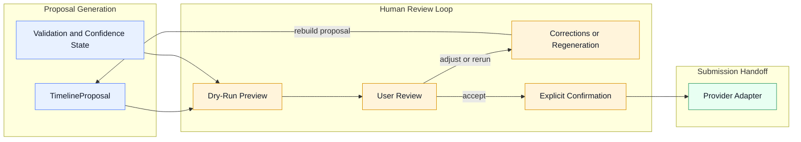

# Operational Pipeline

Back to [Docs Home](../README.md), [Architectural Principles](./architectural-principles.md), [Architecture Decisions](../decisions/README.md), and [Domain Overview](../domain/domain-overview.md).

## Purpose

This page describes how work flows through the system from narrative input to provider handoff.

It explains sequence and responsibility without taking ownership of domain definitions.

## End-to-End Flow

1. Receive a [NarrativeInput](../domain/entities/narrative-input.md).
2. Gather surrounding context such as calendar signals and user configuration.
3. Build [Constraint](../domain/entities/constraint.md) data and derive `AvailableGap` regions.
4. Run semantic interpretation to derive [WorkUnit](../domain/entities/work-unit.md) candidates.
5. Run temporal reconstruction to create [TimelineBlock](../domain/entities/timeline-block.md) allocations.
6. Assemble a [TimelineProposal](../domain/entities/timeline-proposal.md).
7. Attach `Validation/Confidence State` signals and determine whether clarification is needed.
8. Present the proposal for human review, correction, regeneration, or confirmation.
9. Translate the accepted proposal into [ProviderPayload](../domain/entities/provider-payload.md) output.
10. Hand off to the downstream provider adapter for submission.

## Pipeline Notes

- steps 1 through 3 prepare the internal reasoning surface
- steps 4 through 7 are the analyzer-driven reconstruction core
- step 8 enforces human authority
- steps 9 and 10 preserve provider separation from the core domain

## Safety Behavior

The pipeline must prefer clarification over fabrication.

That means low-confidence or contradictory states can interrupt normal progression and route into:

- [Clarification Loop](../analyzer/clarification-loop.md)
- [Failure Modes](../analyzer/failure-modes.md)

instead of quietly pushing weak output downstream.

## Human Review Loop Diagram

This diagram isolates the authority loop around a generated proposal. It focuses on review, correction, regeneration, confirmation, and provider handoff.

## Boundary Reminder

This pipeline describes how work flows.

It does not redefine what the canonical concepts mean. Those definitions remain in the [Domain Overview](../domain/domain-overview.md) and its linked entity pages.
