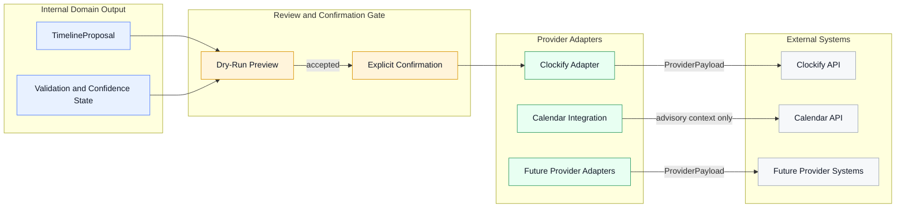

# Provider Architecture

Back to [Docs Home](../README.md), [Architectural Principles](../blueprint/architectural-principles.md), [Architecture Decisions](../decisions/README.md), and [Provider Domain](../domain/provider-domain.md).

## Purpose

This section explains how external providers fit into the system architecture.

Its focus is not on internal meaning or analyzer behavior. Its focus is on the adapter boundary where internal concepts are translated into provider-facing requests.

## Architectural Role

Providers sit at the system edge.

They consume internal output after the system has already produced and validated a [TimelineProposal](../domain/entities/timeline-proposal.md). Their job is to receive a [ProviderPayload](../domain/entities/provider-payload.md), not to define what work means.

## Interaction Diagram

This diagram focuses on the provider boundary: internal reasoning first, confirmation before handoff, and translation only after the proposal is accepted.

## What Provider Adapters Own

Provider adapters should own:

- serialization from internal concepts into provider-specific schemas
- authentication and credential use
- submission and retry behavior
- provider-specific validation at the request boundary
- mapping of internal metadata into provider-compatible fields

## What Provider Adapters Do Not Own

Provider adapters should not own:

- semantic interpretation of narrative updates
- timeline plausibility rules
- user authority decisions
- clarification logic
- canonical domain terminology

Those responsibilities stay in the internal domain and analyzer layers.

## Boundary Rule

The most important provider rule is simple:

- internal reasoning happens first
- provider translation happens after

This preserves the provider-agnostic core established in [ADR-002](../decisions/ADR-002-provider-agnostic-domain.md).

## Current and Future Providers

The first concrete target is Clockify.

Calendar systems also matter, but in a different role: they shape constraints and plausibility rather than acting as timesheet submission targets.

Future providers should be added by implementing new adapters, not by changing the internal meaning of:

- [NarrativeInput](../domain/entities/narrative-input.md)
- [WorkUnit](../domain/entities/work-unit.md)
- [Constraint](../domain/entities/constraint.md)
- [TimelineBlock](../domain/entities/timeline-block.md)
- [TimelineProposal](../domain/entities/timeline-proposal.md)

## Related Pages

- [Clockify Adapter](./clockify-adapter.md)
- [Calendar Provider](./calendar-provider.md)
- [Future Provider Strategy](./future-provider-strategy.md)
